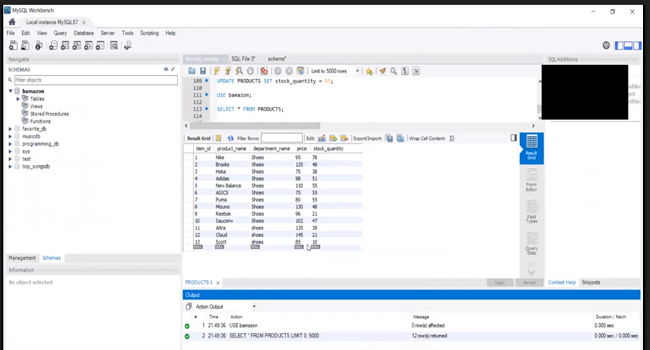

# :department_store: Bamazon!

## Overview
Amazon-like storefront using MySQL and Node.js. It is comprised of two apps - one for customer orders and one for manager actions.

## Functionality

### BamazonCustomer:
    1. Displays a table with the current store inventory
    2. Takes a customer's order
    3. Computes the cost and prints a receipt
    4. Updates the inventory subtracting the latest purchase

### BamazonManager 
    1. View current inventory
    2. View low inventory (set to < 20)
    3. Add to Inventory
    4. Add a new product line

## Technology

* MySQL: Relational Database
* JavaScript: Functional program for logic
* NPM add-ons:
    1. inquirer = for asking the user questions
    2. cTable = for organizing and displaying the console output neatly.

## Video Link
<strong>[Bamazon store app video demonstration](https://drive.google.com/open?id=1myM5Ycymp9T8ULY79YtZSIFycjTSSPl3)</strong>

## Screenshot

